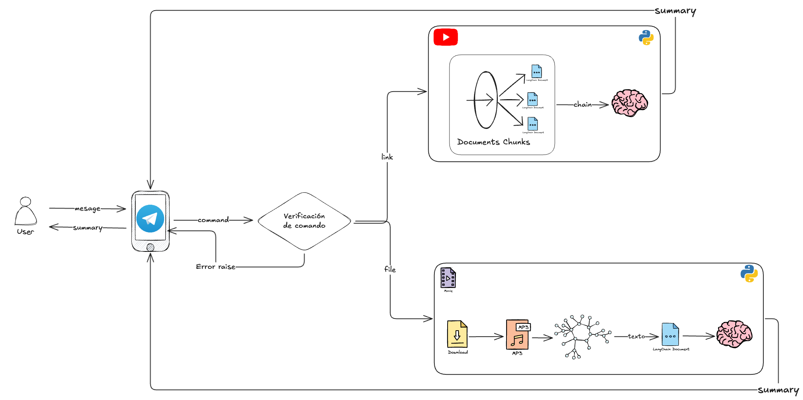

# LLM-based agents

For run the code, you need to run the following commands:

```bash
pipenv install
```

For wishper function, you need to install the command-line tool `ffmpeg` in your system. You can install it with the following commands:

```bash
# on Ubuntu or Debian
sudo apt update && sudo apt install ffmpeg

# on Arch Linux
sudo pacman -S ffmpeg

# on MacOS using Homebrew (https://brew.sh/)
brew install ffmpeg

# on Windows using Chocolatey (https://chocolatey.org/)
choco install ffmpeg

# on Windows using Scoop (https://scoop.sh/)
scoop install ffmpeg
```

Now, you have to create a `.env` file in the root of the project with the following command:

```bash
cp .env.example .env
```

**Add your credentials in the `.env` file.**

Before starting the script, turn on the virtual environment with the following command:

```bash
pipenv shell
```

Finally, you can run the following command to start the server:

```bash
python bot.py
```

---
## Architecture

This is the flow of the project:



## Demo

[Video demo](https://drive.google.com/file/d/1ymNqYnv2eTJzE7fhR63meOPtVP42IJ1G/view?usp=drive_link)
